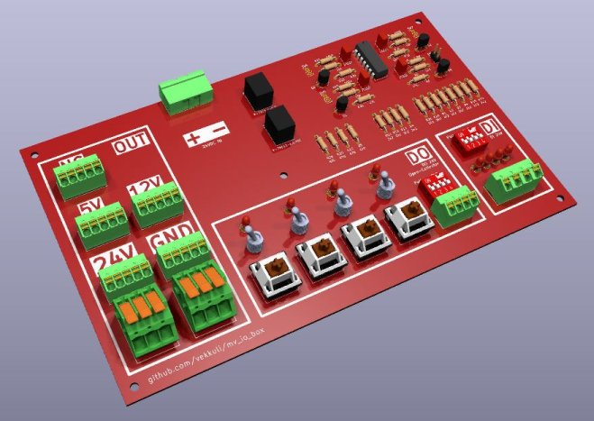
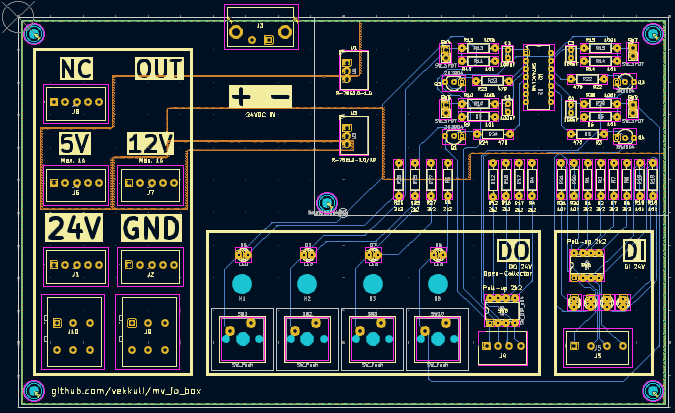

# Machine Vision I/O Box
24 V I/O Box with DIO and 5 and 12 V outputs.

This IO box was developed to be a tool for someone who works with different machine vision devices such as cameras, 3D scanners and other sensors.

## Contents
- KiCad project including all footprints and 3D models.
- Fabrication outputs:
    - Gerbers (made for JLCPCB)
    - Digikey Cart containing parts for about 5 boards.
- 3D printable enclosure.

## Features
- 24 VDC input
- 24 V wire terminal block connector (two different connector sizes)
- GND wire terminal block connector (two different connector sizes)
- Not Connected wire terminal block connector
- 5 V/1 A DC/DC converter + wire terminal block connector
- 12 V/1 A DC/DC converter + wire terminal block connector
- 4 x Digital Output lines with push button and toggle switch. Debounced to roughly 10 ms using RC circuit and Schmitt Trigger. Open Collector output with 2k2 pull-up resistors available via a DIP switch. 3 mm LED indicators.
- 4 x Digital Input connected to 3 mm LED indicators, optional 2k2 pull-up resistors available via a DIP switch.